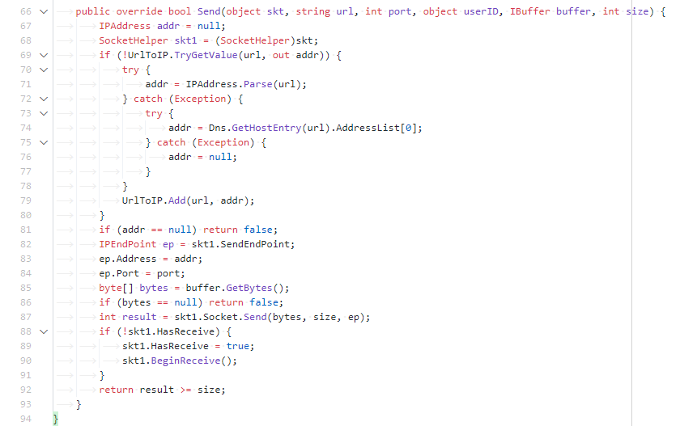

# SillySharp

A Haxe➜C# compiler... based on CustomJSGenerator?

## Why?

- Default generator produces code that's rather verbose
  (full of fully-qualified references and redundant casts)
  and hard to read without cross-referencing it with Haxe source.
- Default C# standard library implementation adds some amount of overhead to operations
  where you wouldn't expect any.
- Standard library routinely reimplements types
  (especially generics) that already exist in .NET.

## What it's good for

Library code that you would probably just write in C# if you didn't already write it in Haxe.

## Noteworthy tweaks

(that might be worth borrowing into the regular C# generator)

- `this.` prefix for non-statics is eliminated where possible.
- `Type.` prefix for statics is eliminated when referencing them in the same type.
- `using Type = Package.Type` is utilized to avoid FQ paths to static variables and types across the file.  
  (except for generics - I don't like the look of `using List_of_Int = Pack.List<int>`)  
  Ambiguous imports will become `Type_1`, `Type_2`, etc. and this system
  avoids aliasing a type into the same name as a current class field.
- C#'s `type?` is used instead of Haxe's `Null<T>`.  
  The way I figure out what's a value type is very limited, but the idea's there.
- Haxe's `for (x in arr)` iterator is mapped to C#'s `foreach (x in arr)` iterator.
- Unnecessary parenthesis are omitted.  
  (with generally no false negatives)
- Unnecessary curly brackets are omitted.  
  (with some false negatives due to using Haxe-JS AST as a base - see below)

## Comparisons

<details><summary>Sending some data over UDP</summary><blockquote>
<details><summary>Haxe</summary><blockquote>

  
(don't worry, this is for development builds only)

</blockquote></details>
<details><summary>hxcs output</summary><blockquote>


</blockquote></details>
<details><summary>sillysharp output</summary><blockquote>

  
Pretty much a direct equivalent of the Haxe code.

</blockquote></details>
</blockquote></details>

<details><summary>A bunch of loops</summary><blockquote>
<details><summary>Haxe</summary><blockquote>

  
That's a macro for C-style for-loops.  
Having used Haxe for a decade, I still think that it should support C-style for-loops natively.

</blockquote></details>
<details><summary>hxcs output</summary><blockquote>


</blockquote></details>
<details><summary>sillysharp output</summary><blockquote>


</blockquote></details>
</blockquote></details>

## Setting up

```
haxelib git sfhx https://github.com/YAL-Haxe/sfhx
haxelib git sillysharp https://github.com/YAL-Haxe/sillysharp
```
Building:
```
haxe -lib sfhx -lib sillysharp -dce full -js myDir
```
**Note:** any extra `.cs` files inside the output directory will be cleaned up,
so don't point this at directories with hand-written files inside.

## Caveats

- Barely any standard library coverage
- No ability to reference DLLs for externs  
  (see [sics-autogen-src] for extracting externs out of the regular hxcs build)
- Consistency is routinely sacrificed for conciseness and/or minor added performance
  (did you know that `"1" + null` is `"1"` in .NET/CLR?)
- May generate ambiguous code if your naming conventions leave much to be desired.
- Haxe-JS is happy to shadow local variables with new ones, which is Pretty Bad for C#
- No ADT support (only C#-styled enums).
- No `Array` class.
- Haxe casts (as opposed to `cs.Lib.as`) won't cast anything because I can't figure out how to detect redundant casts (like `abstract X<Int>` being cast to `int` for nothing).
- Probably two dozen other things that I forgot about because they are not used in the project that
  I'm making this for.


## Challenges

These are mostly "why it's hard to write a non-JS generator based on CustomJSGenerator".

- `String` cannot be overriden using `Compiler.addClassPath`.  
  You either have to overwrite it while offering a default implementation for macros
  (this causes additional issues) or rewrite field references as you build AST.
- JS-specific optimizations (like `str + int` becoming `str + (int == null) ? "null" : int)`)
  cannot be disabled and remain a source of problems both here and in my GML generator.
- `Null<T>` implementation cannot be overriden and it takes effort to map the various ways that nullable values can be used in.
- Haxe compiler reuses non-overlapping local variable names, which is great for JS (or GML) and
  Not Good for C#.
- Generics are pretty hard to work with.  
  Say, I have an `allocVector<T>(size:Int, value:T):Vector<T>` function.  
  Having `var vec:Vector<SomeClass> = allocVector(4, null)` will not work because apparently C# isn't smart enough to figure out the type parameter from what the result is being assigned to.  
  And I'm not sure how to get `[SomeClass]` from `type: Vector<SomeClass>` without having to write a sort of a parser that will compare the type against the signature of the field to extract type parameters.
- The way hxcs-generated generics work bend some rules of the language (e.g. classes allow array access without implementing `ArrayAccess<T>`) but I am not able to do the same for my own.